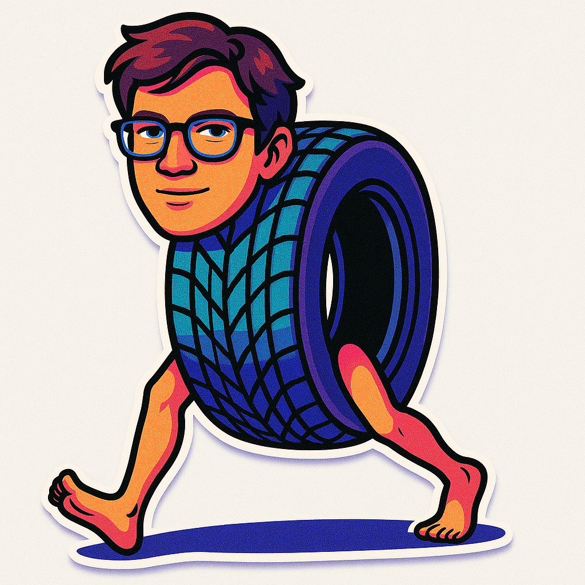

# How I Built Italian Brainrot AI Animals Alternative using AI/ML API


Recently, Italian Brainrot AI Animals got pretty viral on socials.
So... but how to imagine people with these brainrot features?
Instead of Animals there will be people's faces or body parts or whatever.
Just imagine: *Italian Brainrot AI People*.

Let's get started!

> try out live demo [here](https://anora.yaps.gg).


## Introduction

In this tutorial, I'll be guiding you through the whole process of building *Italian Brainrot AI People* node based app. 
We'll cover a lot of interesting and fun things. Primarily, we'll learn a lot of tools and how to use them properly.

Including but not limited to: 

- Setting up the initial project with Reactflow and NextJS
- Building the *beautiful* and *cool* UI/UX with Shadcn UI, Motion Primitives, Prompt Kit and TailwindCSS with minimalistic icons from Phosphor Icons
- Integrating with AI/ML API
- Deploying the app to Vercel
- other interesting stuffs

We'll be using the following latest technologies:

- [AI/ML API](https://aimlapi.com)
- [Reactflow](https://reactflow.dev)
- [NextJS](https://nextjs.org)
- [Shadcn UI](https://ui.shadcn.com)
- [Motion Primitives](https://motion-primitives.com/docs)
- [Prompt Kit](https://www.prompt-kit.com/)
- [TailwindCSS](https://tailwindcss.com)
- [Phosphor Icons](https://phosphoricons.com)
- [Vercel](https://vercel.com)


## Architecture


There are 3 nodes: 
First one just to upload Italian Brainrot AI Animals image as reference image or select from gallery.
Second node is to take a photo with the camera irl.
Third one is to generate the *Italian Brainrot AI People* image. Using those two images as source images.

### Few examples:




## Setting up the initial project

Install and configure shadcn/ui for Next.js.

Run the init command to create a new Next.js project or to setup an existing one:

```bash
npx shadcn@latest init
```

We can now start adding components...

```bash
npx shadcn@latest add button
```

The command above will add the *Button* component to your project. You can then import it like this:

```tsx
import { Button } from "@/components/ui/button"

export default function Home() {
  return (
    <div>
      <Button>WEI</Button>
    </div>
  )
}
```


## Reactflow

Let's create a reactflow playground.

First, install the dependencies:

```bash
npm install @xyflow/react
```


### Define the node types

Create a new file called `types/node.ts` and import the dependencies.
This file is used to define the node types.

> you can basically ignore Text and Video types. We'll not cover them in this tutorial.

```tsx
import { Node, BuiltInNode, Edge } from '@xyflow/react'
import { Icon } from '@phosphor-icons/react'
import { ImageSize } from '@/lib/models/types'

// ——————————————————————————————————————————————
// Style & Ratio / Duration Primitives
// ——————————————————————————————————————————————

export type ImageStyle = {
  id: string
  name: string
  image: string
  thumbnail: string
  description: string
  prompt: string
}

export type Style = {
  id: string
  name: string
  description: string
  disabled: boolean
  icon: string | Icon
  thumbnail: string
  style: ImageStyle[]
}

export type Ratio = `${number}:${number}`

export type Duration = number // in seconds (for videos, animations, etc.)

// ——————————————————————————————————————————————
// Block Types
// ——————————————————————————————————————————————

export type BlockType = 'text' | 'image' | 'image-transformer' | 'video'

// ——————————————————————————————————————————————
// Block Status
// ——————————————————————————————————————————————

export type BlockStatus = 'queued' | 'generating' | 'completed' | 'failed'

// ——————————————————————————————————————————————
// Per-Type Data Interfaces
// ——————————————————————————————————————————————

export interface TextData extends Record<string, unknown> {
  id: string
  type: 'text'
  rawText?: string      // original text input
  generatedText?: string // result
  prompt?: string
  modelChoice?: string
  status?: BlockStatus
}

export interface ImageData extends Record<string, unknown> {
  id: string
  type: 'image'
  src?: string           // input image
  prompt?: string
  modelChoice?: string
  style: ImageStyle
  generatedImage?: string
  seed?: number
  status?: BlockStatus
  imageSize?: ImageSize
  count?: number
}

export interface ImageTransformerData extends Record<string, unknown> {
  id: string
  type: 'image-transformer'
  src?: string[]            // input to transform
  prompt?: string
  modelChoice?: string
  style: ImageStyle
  generatedImage?: string
  seed?: number
  status?: BlockStatus
  imageSize?: ImageSize
  count?: number
}

export interface VideoData extends Record<string, unknown> {
  id: string
  type: 'video'
  src?: string[]      // input URL or source
  prompt?: string        // for text→video generation
  modelChoice?: string
  generatedVideoUrl?: string
  seed?: number
  status?: BlockStatus
  duration?: Duration
  ratio?: Ratio
}

// ——————————————————————————————————————————————
// Discriminated Union of All Block Data
// ——————————————————————————————————————————————

export type BlockData =
  | TextData
  | ImageData
  | ImageTransformerData
  | VideoData

// ——————————————————————————————————————————————
// AppNode Variants
// ——————————————————————————————————————————————

export type TextNode             = Node<TextData, 'text'>
export type ImageNode            = Node<ImageData, 'image'>
export type ImageTransformerNode = Node<ImageTransformerData, 'image-transformer'>
export type VideoNode            = Node<VideoData, 'video'>
export type AppNode =
  | BuiltInNode
  | TextNode
  | ImageNode
  | ImageTransformerNode
  | VideoNode

// ——————————————————————————————————————————————
// TemplateNode (enforcing ratio/duration on applicable types)
// ——————————————————————————————————————————————

type WithRatio<T>    = T extends { ratio: infer R }    ? Required<Pick<T, 'ratio'>>    : {}
type WithDuration<T> = T extends { duration: infer D } ? Required<Pick<T, 'duration'>> : {}

export type TemplateNode<T extends BlockData = BlockData> =
  Node<T & WithRatio<T> & WithDuration<T>, T['type']>

// ——————————————————————————————————————————————
// Templates & Flows
// ——————————————————————————————————————————————

export interface TemplateBase {
  id: string
  name: string
  description: string
  thumbnail: string | Icon
}

export interface SingleNodeTemplate extends TemplateBase {
  kind: 'single'
  node: TemplateNode
}

export interface MultiNodeTemplate extends TemplateBase {
  kind: 'multi'
  nodes: TemplateNode[]
  edges: Edge[]
}

export type Template = SingleNodeTemplate | MultiNodeTemplate

export interface Flow {
  id: string
  name: string
  description: string
  disabled: boolean
  thumbnail: string | Icon
  templates: Template[]
}
```


### Playground

Then, create a new file called `playground.tsx` and import the dependencies.
We'll create all the necessary components `FloatingSidebar`, `TaskStatus`, `LayoutClient` and hooks `useNodeManagement`, `useNodeStatus` later in the tutorial.

```tsx
'use client'

import { useCallback, useEffect, useRef, useState } from 'react';
import {
  ReactFlow,
  Background,
  addEdge,
  useNodesState,
  useEdgesState,
  type OnConnect,
  type OnConnectStart,
  useReactFlow,
  type Edge,
  SelectionMode,
  ConnectionLineType,
  BackgroundVariant,
  PanOnScrollMode
} from '@xyflow/react';
import '@xyflow/react/dist/style.css';
import '@/app/dashboard/overrides.css';

import { nodeTypes } from '@/components/nodes';
import { edgeTypes } from '@/components/edges';
import { FloatingSidebar } from '@/components/floating-sidebar';
import { AppNode } from '@/types/node';
import { TaskStatus } from '@/components/flow-status';
import { LayoutClient } from "@/app/layout-client";
import { useNodeManagement } from '@/hooks/use-node-management';
import { useNodeStatus } from '@/hooks/use-node-status';
```

Initialize the state for the nodes and edges.


```tsx
export default function Dashboard() {
  // Initialize state
  const [nodes, setNodes, onNodesChange] = useNodesState<AppNode>([]);
  const [edges, setEdges, onEdgesChange] = useEdgesState<Edge>([]);
  
  const reactFlowInstance = useReactFlow();
  const connectionStartNodeRef = useRef<string | null>(null);

  // Ensure the canvas is properly centered
  useEffect(() => {
    const timer = setTimeout(() => {
      reactFlowInstance.fitView({ padding: 0.2 });
    }, 50);
    return () => clearTimeout(timer);
  }, [reactFlowInstance]);
  
  const { 
    connectionEndState,
    hideConnectionEndPopover,
  } = useNodeManagement();
  
  const { statusList, updateEdgeAnimations } = useNodeStatus();
  const [isTaskStatusOpen, setIsTaskStatusOpen] = useState(false);
  
  // Track connection start node
  const onConnectStart: OnConnectStart = useCallback(
    (_, params) => {
      connectionStartNodeRef.current = params.nodeId;
    },
    []
  );

  const onConnect: OnConnect = useCallback(
    (connection) => setEdges((edges) => addEdge(connection, edges)),
    [setEdges]
  );

  // Update edge animations when status changes
  useEffect(() => {
    updateEdgeAnimations();
  }, [updateEdgeAnimations, statusList]);

  // Add drop event handlers
  const onDragOver = useCallback((event: React.DragEvent) => {
    event.preventDefault();
    event.dataTransfer.dropEffect = 'move';
  }, []);
```

Initialize the reactflow component.


```tsx
  return (
        <div className="max-w-screen h-screen flow-wrapper">
            <ReactFlow
                nodes={nodes}
                nodeTypes={nodeTypes}
                onNodesChange={onNodesChange}
                edges={edges}
                edgeTypes={edgeTypes}
                connectionLineType={ConnectionLineType.Bezier}
                onEdgesChange={onEdgesChange}
                onConnect={onConnect}
                onConnectStart={onConnectStart}
                onDragOver={onDragOver}

                fitView
                proOptions={{ hideAttribution: true }}

                defaultEdgeOptions={{
                    style: {
                        stroke: '#71717a',
                    }
                }}
                defaultMarkerColor='#71717a'

                snapToGrid={true}
                snapGrid={[30, 30]}

                panOnScroll={true}
                panOnScrollMode={PanOnScrollMode.Free}
                panOnScrollSpeed={0.5}

                panOnDrag={false}
                selectionOnDrag={true}
                multiSelectionKeyCode={['Shift']}
                selectionMode={SelectionMode.Partial}
                elevateNodesOnSelect={true}

                minZoom={0.1}
                maxZoom={2}

                zoomOnScroll={false}
                zoomOnPinch={true}
                preventScrolling={true}
                zoomOnDoubleClick={false}
                noWheelClassName="nowheel"
            >
                <Background 
                    variant={BackgroundVariant.Dots}
                    color="#71717a"
                    bgColor="#09090b"
                    gap={30}
                />

                <TaskStatus 
                    isOpen={isTaskStatusOpen} 
                    setIsOpen={setIsTaskStatusOpen} 
                />

            </ReactFlow>

            <FloatingSidebar 
                onEmptySpaceDrag={connectionEndState.isVisible ? hideConnectionEndPopover : undefined} 
            />

            <LayoutClient /> 
        </div>
    );
}
```


### Floating Sidebar

Create a new file called `floating-sidebar.tsx` and import the dependencies.
This component is used to display the sidebar on the canvas.
It has a button to add new nodes to the canvas.

```tsx
'use client';

import React, { useState, useRef } from 'react';
import { Button } from './ui/button';
import {
  Plus,
  Minus,
} from '@phosphor-icons/react/dist/ssr';
import { useReactFlow } from '@xyflow/react';
import NodePopover from './nodes/node-popover';
import type { BlockType } from '../types/node';
import useClickOutside from '@/hooks/use-click-outside';
import { addNodeCentered } from './nodes/utils';
import { SidebarMotionPopover } from './common/motion-popover';

// Supported popover types
type PopoverType = 'add' | null;

interface SidebarButtonConfig {
  type: PopoverType;
  icon: React.ReactNode;
  onClick?: () => void;
  onMouseEnter?: () => void;
  activeClass: string;
  inactiveClass: string;
}

export function FloatingSidebar({ 
  onEmptySpaceDrag 
}: { onEmptySpaceDrag?: () => void }) {
  const [activePopover, setActivePopover] = useState<PopoverType>(onEmptySpaceDrag ? 'add' : null);
  const { getViewport, addNodes } = useReactFlow();
  const wrapperRef = useRef<HTMLDivElement>(null);
  
  // always open clicked popover
  const openPopover = (type: PopoverType) => {
    if (type === 'add') {
      setActivePopover(prev => (prev === type ? null : type));
    } else {
      setActivePopover(type);
    }
  };

  // true if given popover is active
  const isOpen = (type: PopoverType) => activePopover === type;

  // add node centered
  const handleAddNode = (type: BlockType) => {
    addNodeCentered(type, getViewport, addNodes, setActivePopover);
  };

  // close popover when clicking outside
  useClickOutside(wrapperRef, () => setActivePopover(null));

  // button definitions
  const buttons: SidebarButtonConfig[] = [
    {
      type: 'add',
      icon: (isOpen('add') || onEmptySpaceDrag) ? <Minus size={20} weight="bold" /> : <Plus size={20} weight="bold" />,  
      onClick: () => openPopover('add'),
      activeClass: 'bg-foreground/80',
      inactiveClass: 'bg-foreground',
    },
  ];

  return (
    <div ref={wrapperRef} className="fixed left-4 top-1/2 transform -translate-y-1/2 z-10">
      <div className="flex flex-col gap-4 items-center bg-card/80 dark:bg-card/80 backdrop-blur-sm rounded-full border border-border p-2">
        {buttons.map(({ type, icon, onClick, onMouseEnter, activeClass, inactiveClass }) => (
          <Button
            key={type}
            onClick={onClick}
            onMouseEnter={onMouseEnter}
            variant={type === 'add' ? 'default' : 'ghost'}
            size="icon"
            className={`cursor-pointer ${(type === 'add' || type === 'user') ? 'rounded-full' : 'rounded-lg'} ${isOpen(type) ? activeClass : inactiveClass}`}
          >
            {icon}
          </Button>
        ))}
      </div>

      {isOpen('add') && (
        <SidebarMotionPopover className='top-0'>
          <NodePopover handleAddNode={handleAddNode} />
        </SidebarMotionPopover>
      )}
    </div>
  );
}
```


### Sidebar Motion Popover

Create a new file called `sidebar-motion-popover.tsx` and import the dependencies.
This component is used to display the animated popover on the sidebar.

```tsx
'use client'

import { motion, AnimatePresence } from 'framer-motion'
import { cn } from '@/lib/utils';

interface MotionPopoverProps {
    children: React.ReactNode;
    className?: string;
    position?: 'left' | 'right' | 'top' | 'bottom';
    width?: string;
    maxHeight?: string;
}

export function MotionPopover({ 
    children,
    className,
    position = 'left',
    width = 'min-w-80',
    maxHeight = 'max-h-[50vh]'
}: MotionPopoverProps) {
    const positionClasses = {
        left: 'left-16 top-0',
        right: 'right-16 top-0',
        top: 'top-16 left-0',
        bottom: 'bottom-16 left-0'
    };

    return (
        <AnimatePresence mode="wait">
            <motion.div
                initial={{ opacity: 0, y: -10 }}
                animate={{ opacity: 1, y: 0 }}
                exit={{ opacity: 0, y: 10 }}
                transition={{ duration: 0.2 }}
                className={cn(
                    "absolute z-50 bg-card/80 backdrop-blur-sm rounded-xl border border-border shadow-sm overflow-hidden",
                    positionClasses[position],
                    width,
                    maxHeight,
                    className
                )}
            >
                {children}
            </motion.div>
        </AnimatePresence>
    )
}

export function SidebarMotionPopover({ children, className }: MotionPopoverProps) {
    return (
        <MotionPopover 
            className={className}
            position="left"
        >
            {children}
        </MotionPopover>
    )
}
```


### Node Popover

Create a new file called `node-popover.tsx` and import the dependencies.
This component is used to display available nodes in the popover on the sidebar.

```tsx
import { BlockType } from "../../types/node";
import { Icon, ImageSquare, ImageBroken, ArrowUp } from "@phosphor-icons/react";
import { MotionButton } from "../common/motion-button";

interface NodeButton {
    icon: Icon;
    label: string;
    description: string;
    type: BlockType;
};

const NODE_BUTTONS: NodeButton[] = [
    {
      icon: ImageSquare,
      label: 'Image',
      description: 'Upload or generate images',
      type: 'image',
    },
    {
      icon: ImageBroken,
      label: 'Image Transformer',
      description: 'Create new images from images',
      type: 'image-transformer',
    },
];

// Define valid connections based on source node type
const VALID_CONNECTIONS: Record<BlockType, BlockType[]> = {
    'image': ['image-transformer'],
    'image-transformer': ['image-transformer'],
};
  
interface NodePopoverProps {
    handleAddNode: (type: BlockType) => void;
    sourceNodeType?: BlockType; // Optional - if provided, filter node options based on valid connections
}

export default function NodePopover({ handleAddNode, sourceNodeType }: NodePopoverProps) {
    // Filter node buttons based on sourceNodeType if provided
    const filteredButtons = sourceNodeType 
        ? NODE_BUTTONS.filter(button => VALID_CONNECTIONS[sourceNodeType].includes(button.type))
        : NODE_BUTTONS;
        
    return (
        <div className="p-1">
            <h2 className="text-xs font-medium mb-2 p-2 text-accent-foreground">
                {sourceNodeType ? 'CONNECT TO' : 'ADD BLOCK'}
            </h2>
            <div className="flex flex-col gap-1">
                {filteredButtons.map((button) => (
                    <MotionButton
                        key={button.label}
                        leadingIcon={<button.icon size={16} />}
                        title={button.label}
                        description={button.description}
                        onClick={() => handleAddNode(button.type)}
                        descriptionPosition="top"
                        endContent={<ArrowUp size={16} className="text-muted-foreground" />}
                        showEndContentOnHover={true}
                    />
                ))}
            </div>
        </div>
    )
}
```

### Set up Node Utils

Create a new file called `utils.ts` and import the dependencies.
This file is used to add a new node centered in the viewport.

```tsx
import { Node } from '@xyflow/react';
import { BlockType, ImageStyle } from '../../types/node';

/**
 * Add a new node centered in the viewport
 */
export const addNodeCentered = (
  type: BlockType,
  getViewport: () => { x: number; y: number; zoom: number },
  addNodes: (node: Node) => void,
  setActivePopover?: (value: any) => void
) => {
  const { x, y, zoom } = getViewport();
  const position = {
    x: (window.innerWidth / 2 - x) / zoom,
    y: (window.innerHeight / 2 - y) / zoom,
  };
  const id = `${type}-${Date.now()}`;
  addNodes({ id, type, position, data: { id, type } } as Node);
  
  // Close any active popover if function is provided
  if (setActivePopover) {
    setActivePopover(null);
  }
};
```

Next we'll create reusable components for the nodes.

### Custom Handle

Create a new file called `custom-handle.tsx` and import the dependencies.
This component is used to display the custom handle on the node.

```tsx
'use client'

import { Handle, Position, type HandleProps } from '@xyflow/react';
import { cn } from '@/lib/utils';

type CustomHandleProps = HandleProps & {
  showPlus?: boolean;
  isVisible?: boolean;
};

export function CustomHandle({
  type,
  position,
  id,
  isVisible = false,
  showPlus = false,
  style,
  className,
  ...rest
}: CustomHandleProps) {
  return (
    <div className="">
      <Handle
        type={type}
        position={position}
        id={id}
        className={cn(
          `${isVisible ? 'opacity-100' : 'opacity-0'} transition-opacity duration-300`,
          className
        )}
        style={{
          width: showPlus ? 14 : undefined,
          height: showPlus ? 14 : undefined,
          marginRight: position === Position.Right && showPlus ? -14 : undefined,
          marginLeft: position === Position.Left && showPlus ? -14 : undefined,
          backgroundColor: showPlus ? 'transparent' : undefined,
          ...style
        }}
        {...rest}
      />
    </div>
  );
}
```

### Node Wrapper

Create a new file called `node-wrapper.tsx` and import the dependencies.
This component is reusable and can be used for any node.

```tsx
'use client';

import React from 'react';
import { cn } from '@/lib/utils';

type NodeWrapperProps = React.HTMLAttributes<HTMLDivElement> & {
  children: React.ReactNode;
  selected: boolean;
  setIsHovered: (isHovered: boolean) => void;
  style?: React.CSSProperties;
  className?: string;
};

const NodeWrapper = React.forwardRef<HTMLDivElement, NodeWrapperProps>(
  (
    {
      children,
      selected,
      setIsHovered,
      style,
      className,
      ...props
    }: NodeWrapperProps,
    ref
  ) => (
    <div
      ref={ref}
      className={cn(
        'relative rounded-2xl shadow bg-card/80 dark:bg-card/80 backdrop-blur-sm border',
        selected
          ? 'border-primary/70 dark:border-primary/70 transition-all ease-in-out duration-300'
          : 'border-border dark:border-border',
        'w-80 h-80 flex flex-col',
        className
      )}
      onMouseEnter={() => setIsHovered(true)}
      onMouseLeave={() => setIsHovered(false)}
      style={style}
      {...props}
    >
        {children}
    </div>
  )
);

NodeWrapper.displayName = 'NodeWrapper'; // Helpful for debugging in React DevTools

export default NodeWrapper;
```


### Node Label

Create a new file called `node-label.tsx` and import the dependencies.
This component is used to display the label on top of the node.

```tsx
import { NodeToolbar as INodeToolbar, Position } from "@xyflow/react";
import { Label } from "@/components/ui/label";

interface NodeLabelProps {
  children: React.ReactNode;
}

export function NodeLabel({ children }: NodeLabelProps) {
    return (
        <INodeToolbar 
            isVisible={true}
            position={Position.Top} 
            align="start"
            offset={6}
        >
            <Label className="text-xs uppercase text-muted-foreground">
                {children}
            </Label>
        </INodeToolbar>
    );
}
```


### Node Toolbar

Finally Node Toolbar.

Show different buttons based on the node type.
- `{(displayNodeType === 'image') && ()}`
- `{(displayNodeType === 'image-transformer') && ()}`


```tsx
import { motion, AnimatePresence } from 'framer-motion';
import { useState, useCallback, memo, useEffect, useRef } from 'react';
import { ModelConfig as Model } from '@/lib/models/types';
import { NodeToolbar as XYFlowNodeToolbar, Position } from '@xyflow/react';
import { DeleteButton } from './toolbar-actions/delete-button';
import { ModelButton } from './toolbar-actions/model-button';
import { DownloadButton } from './toolbar-actions/download-button';
import { DEFAULT_IMAGE_MODEL } from '@/lib/models/config';

// note: never put fullscreen button in the toolbar!!

interface NodeToolbarProps {
  nodeId: string;
  visible: boolean;
  selected: boolean;
  onDelete: () => void;
  onDownload: () => void;
  modelChoice: string;
  models: Model[];
  onModelChange: (value: string) => void;
}

function NodeToolbar({
  nodeId,
  visible,
  selected,
  onDelete,
  onDownload,
  onModelChange,
  modelChoice = DEFAULT_IMAGE_MODEL.id,
  models = [],
}: NodeToolbarProps) {
  
  // State for all popovers
  const [isModelGalleryOpen, setIsModelGalleryOpen] = useState(false);
  
  // Ref for the toolbar
  const toolbarRef = useRef<HTMLDivElement>(null);
  
  // Find selected model once to prevent re-renders
  const selectedModel = models.find(model => model.id === modelChoice) || models[0];
  
  // Close all popovers
  const closeAllPopovers = useCallback(() => {
    setIsModelGalleryOpen(false);
  }, []);

  useEffect(() => {
    if (selected === false) {
      closeAllPopovers();
    }
  }, [selected, closeAllPopovers]);

  // Toggle handlers for each popover
  const toggleModelGallery = useCallback(() => {
    setIsModelGalleryOpen(prev => !prev);
  }, []);
  
  // Selection handlers
  const handleSelectModel = useCallback((model: Model) => {
    onModelChange(model.id);
    setIsModelGalleryOpen(false);
  }, [onModelChange]);
  
  return (
    <XYFlowNodeToolbar 
      isVisible={visible}
      position={Position.Top} 
      className="z-50"
      offset={30}
    >
      <AnimatePresence mode="wait">
        {visible && (
          <motion.div
            ref={toolbarRef}
            key={nodeId}
            initial={{ opacity: 0, y: 20 }}
            animate={{ opacity: selected ? 1 : 0.5, y: 0 }}
            exit={{ opacity: 0, y: 20 }}
            transition={{ duration: 0.2 }}
            className="flex flex-row gap-1 bg-card/90 dark:bg-card/90 backdrop-blur-sm rounded-xl p-1 shadow-lg border border-border"
          >
            {/* Common buttons for all node types */}
            <DownloadButton
              onDownload={onDownload}
            />
            
            <ModelButton
              handleToggleModelGallery={toggleModelGallery}
              isModelGalleryOpen={isModelGalleryOpen}
              selectedModel={selectedModel}
              models={models}
              handleSelectModel={handleSelectModel}
            />
            
            {/* Delete button is common for all node types */}
            <DeleteButton onDelete={onDelete} />
          </motion.div>
        )}
      </AnimatePresence>
    </XYFlowNodeToolbar>
  );
}

export default memo(NodeToolbar); 
```


### Button Actions

Let's create few buttons for the toolbar.

#### Download Button

Create a new file called `download-button.tsx` and import the dependencies.
This component is used to download the image.

```tsx
import { Button } from "@/components/ui/button"
import { DownloadSimple } from "@phosphor-icons/react/dist/ssr"
import { memo } from "react"

interface DownloadButtonProps {
    onDownload: () => void;
}

export const PureDownloadButton = ({ onDownload }: DownloadButtonProps) => {
    return (
        <Button
            variant="ghost"
            size="sm_icon"
            onClick={onDownload}
            title="Download"
            className='text-muted-foreground shrink-0'
        >
            <DownloadSimple size={16} />
      </Button>
    )
}

export const DownloadButton = memo(PureDownloadButton);
```

#### Model Button

Create a new file called `model-button.tsx` and import the dependencies.
This component is used to select the model.

```tsx
import { ModelsPopover } from "@/components/models-popover"
import { CaretRight } from "@phosphor-icons/react/dist/ssr"
import { Button } from "@/components/ui/button"
import { motion } from "framer-motion"
import { ModelConfig as Model } from "@/lib/models/types";
import { memo } from "react";

interface ModelButtonProps {
    handleToggleModelGallery: () => void;
    isModelGalleryOpen: boolean;
    selectedModel: Model;
    models: Model[];
    handleSelectModel: (model: Model) => void;
}

export const PureModelButton = ({ handleToggleModelGallery, isModelGalleryOpen, selectedModel, models, handleSelectModel }: ModelButtonProps) => {
    return (
        <div className="relative">
            <Button
              variant="ghost"
              size="sm"
              className="w-full min-w-20 text-xs text-muted-foreground px-2 rounded-lg"
              onClick={handleToggleModelGallery}
            >
                {typeof selectedModel.icon === "string" 
                    ?  
                    : <selectedModel.icon size={16} />}
                {selectedModel?.name || "Select Model"}
                <motion.div
                    animate={{ rotate: isModelGalleryOpen ? 90 : 0 }}
                    transition={{ duration: 0.2 }}
                    className='ml-auto shrink-0'
                >
                    <CaretRight size={16} className='size-3' />
                </motion.div>
            </Button>
            <ModelsPopover
                models={models}
                disabled={false}
                isOpen={isModelGalleryOpen}
                handleSelectModel={handleSelectModel}
                selectedModel={selectedModel}
            />
        </div>
    )
}

export const ModelButton = memo(PureModelButton);
```


#### Delete Button

Create a new file called `delete-button.tsx` and import the dependencies.
This component is used to delete the node.

```tsx
import { Button } from "@/components/ui/button"
import { Broom } from "@phosphor-icons/react/dist/ssr"
import { memo } from "react"

interface DeleteButtonProps {
    onDelete: () => void;
}

export const PureDeleteButton = ({ onDelete }: DeleteButtonProps) => {
    return (
        <Button
            variant="ghost"
            size="sm_icon"
            onClick={onDelete}
            title="Delete Node"
            className='text-muted-foreground shrink-0'
        >
            <Broom size={16} />
      </Button>
    )
}

export const DeleteButton = memo(PureDeleteButton);
```


## Model Config

Create a new file called `model-config.ts` and import the dependencies.
This component is used to configure the model.

```tsx
// ─── lib/models/types.ts ──────────────────────────────────────────────────────
import { Ratio, Duration } from "@/types/node";

import { Icon } from "@phosphor-icons/react";

/** Which kinds of outputs a model can generate */
export type ModelType = "image";

/** What inputs a model accepts */
export type ModelInput = "image";

/** What size a model supports */
export type ImageSize = "1:1" | "4:3" | "3:4";

export type OpenAIImageSize = "1024x1024" | "1536x1024" | "1024x1536";

/** Core model description (as loaded from your config or API) */
export interface ModelConfig {
  /** unique, kebab-case ID. it's also the model name that will be passed to the API */
  id: string;
  /** human-readable name */
  name: string;
  /** provider ID (must match one in ProviderConfig[]) */
  provider: string;
  /** short summary of what this model does */
  description: string;
  /** what it produces */
  type: ModelType;
  /** what it accepts (or [“image”,“text”] if both) */
  input: ModelInput | ModelInput[];
  /** credits per call, time per call */
  credits: number;
  time: number;
  /** if false, hide it in the UI */
  available?: boolean;
  /** endpoint override (e.g. “/v1/generate/text”) */
  apiEndpoint?: string;
  /** optional seed override */
  seed?: number;
  /** model name (e.g. "runway/gen4_turbo") that will be passes as a body parameter */
  model?: string;
  /** icon to show in the picker */
  icon: Icon | string;
}

/** A provider entry (e.g. “openai”, “mistral”) */
export interface ProviderConfig {
  id: string;
  name: string;
  icon: Icon | string;
  available: boolean;
}

export type Settings = {
    imageSize?: ImageSize;
    ratio?: Ratio;
    duration?: Duration;
}

export type SettingsOption = {
    id: string;
    name: string;
    description: string;
    icon: Icon | string;
    iconRotated?: boolean;
    value: any;
}
```

### Set up Image Generation Models

Create a new file called `image-gen.ts` and import the dependencies.

```tsx
import { OpenAiLogo } from "@phosphor-icons/react"
import { ModelConfig as Model } from "./types"

export const IMAGE_TRANSFORMER_MODELS: Model[] = [
    {
      id: "gpt-image-1",
      name: "GPT-Image 1",
      provider: "openai",
      description: "OpenAI's image editing model",
      type: "image",
      input: "image",
      icon: OpenAiLogo,
      credits: 50,
      time: 60,
      available: true,
    },
]
  
export const IMG_GENERATOR_MODELS: Model[] = [
    {
      id: "gpt-image-1",
      name: "GPT-Image 1",
      provider: "openai",
      description: "OpenAI's advanced image generation model",
      type: "image",
      input: "text",
      icon: OpenAiLogo,
      credits: 50,
      time: 60,
      available: true,
    },
    {
      id: "dall-e-3",
      name: "Dall-E 3",
      provider: "openai",
      description: "OpenAI's image generation model",
      type: "image",
      input: "text",
      icon: OpenAiLogo,
      credits: 30,
      time: 20,
      available: true,
    },
    {
      id: "dall-e-2",
      name: "Dall-E 2",
      provider: "openai",
      description: "OpenAI's image generation model",
      type: "image",
      input: "text",
      icon: OpenAiLogo,
      credits: 24,
      time: 20,
      available: true,
    },
]
```

## API

Create a new folder called `api`. 
We'll create API endpoints inside this folder.
Since we're using NextJS, we can simply define the API routes inside the folder.

Create a new file; `images/generations/routes.ts` inside the `api` folder and import the dependencies.

Learn more about the OpenAI's Image Generation API [here](https://platform.openai.com/docs/guides/image-generation?image-generation-model=gpt-image-1).

```tsx
// /api/images/generations

import { NextRequest, NextResponse } from "next/server";
import OpenAI, { toFile } from "openai";

// Initialize OpenAI client
const openai = new OpenAI({
    baseURL: process.env.AIML_API_BASE_URL,
    apiKey: process.env.AIML_API_KEY,
});

export async function POST(request: NextRequest) {
  try {
    const formData = await request.formData();
    const prompt = formData.get('prompt') as string || '';
    const model = formData.get('model') as string || 'gpt-image-1';
    const input = formData.get('input') as string || 'image';
    const sizeParam = formData.get('size') as Ratio || '1024:1024';
    const n = parseInt(formData.get('n') as string || '1', 10);

    if (input === 'image') {
        // Process images from formData
        const imageFiles: File[] = [];
        const imageKeys = Array.from(formData.keys()).filter(key => key.startsWith('image'));
        
        for (const key of imageKeys) {
            const file = formData.get(key) as File;
            if (file) {
                imageFiles.push(file);
            }
        }
        
        if (imageFiles.length === 0) {
            return NextResponse.json({
                error: "No images provided"
            }, { status: 400 });
        }
        
        // Validate for edit API
        const editSize = ratioToEditSize(sizeParam as Ratio); 
        // openai forgot to add few sizes that are actually valid for edits
        // ignore the below error for now
        
        // Call OpenAI API for image editing
        const response = await openai.images.edit({
            model: model,
            image: imageFiles,
            prompt: prompt,
            n: n,
            size: editSize as any,
        });

        // Check if we have data
        if (!response.data || response.data.length === 0) {
            return NextResponse.json({
                error: "Failed to generate image"
            }, { status: 500 });
        }

        // Return all generated images
        return NextResponse.json({
            data: response.data
        });
    }
    
    // Validate for generate API
    const generateSize = ratioToGenerationSize(sizeParam);
    
    // Call OpenAI API for text-to-image generation
    const response = await openai.images.generate({
        model: model,
        prompt: prompt,
        n: n,
        size: generateSize,
    });

    // Check if we have data
    if (!response.data || response.data.length === 0) {
        return NextResponse.json({
            error: "Failed to generate image"
        }, { status: 500 });
    }

    // Return all generated images
    return NextResponse.json({
        data: response.data
    });
    
  } catch (error) {
    console.error('Error in images generations API:', error);
    return NextResponse.json(
      {
        error: error instanceof Error ? error.message : 'Unknown error occurred',
      },
      { status: 500 }
    );
  }
}
```

## Nodes

### Image Node UI

Create a new file called `image-node-ui.tsx` and import the dependencies.
This component is used to display the image node on the canvas.

## Part 1: Boilerplate & Hooks

**Goal:** Pull in all your imports, set up state + refs, and wire up your core logic hook.

```tsx
'use client'

import { useState, useRef, useCallback, useEffect, memo } from 'react'
import { Position, type NodeProps, useReactFlow } from '@xyflow/react'
import { ALL_IMAGE_MODELS, DEFAULT_IMAGE_MODEL } from '@/lib/models/config'
import { useNodeStatus } from '@/hooks/use-node-status'
import { useUser } from '@/providers/user-provider'
import { useImageNodeLogic } from './logic'
import NodeWrapper from '@/components/nodes/node-wrapper'
import NodeToolbar from '@/components/nodes/node-toolbar'
import NodeLabel from '@/components/nodes/node-label'
import { ImageNode as ImageNodeType, ImageStyle } from '../../../types/node'
import { ChatInput } from '@/components/common/chat-input'
import { CustomHandle } from '@/components/common/custom-handle'
import { Position } from '@xyflow/react'

export function ImageNode({ id, data, selected }: NodeProps<ImageNodeType>) {
  // ————— state & refs —————
  const [isHovered, setIsHovered]           = useState(false)
  const [imageSrc,  setImageSrc]            = useState<string | undefined>(data.src)
  const [prompt,    setPrompt]              = useState<string>(data.prompt ?? '')
  const [modelChoice, setModelChoice]       = useState(data.modelChoice ?? DEFAULT_IMAGE_MODEL.id)
  const fileInputRef = useRef<HTMLInputElement>(null)

  // React Flow methods & custom hooks
  const { getEdges }      = useReactFlow()
  const { updateNodeStatus, removeNodeStatus } = useNodeStatus()
  const { hasEnoughCredits, decreaseCredits }   = useUser()

  // Business logic (API calls, credit checks, etc.)
  const {
    getSourceText,
    updateImageSrc,
    updatePrompt,
    updateModelChoice,
    downloadImage,
    handleMultipleGeneration
  } = useImageNodeLogic(id, data, modelChoice)
```

## Part 2: Syncing Props → State

**Goal:** Whenever `data` from React Flow updates, push it into your local state so UI stays in sync.

```tsx
  // Whenever the node’s `data` object changes,
  // re-seed our local hooks & states:
  useEffect(() => {
    if (data.src)           setImageSrc(getProxiedImageUrl(data.src))
    if (data.prompt)        setPrompt(data.prompt)
    if (data.modelChoice)   setModelChoice(data.modelChoice)
    if (data.style)         setCurrentStyle(data.style)
    if (data.imageSize)     setImageSize(data.imageSize)
    if (data.generationCount)
                             setCount(data.generationCount)
  }, [data])
```


## Part 3: File Upload & Drag-Drop

**Goal:** Let users click to open a file picker or drag images right onto the node.

```tsx
  const handleFileUpload = (e: React.ChangeEvent<HTMLInputElement>) => {
    const file = e.target.files?.[0]
    if (!file) return

    const reader = new FileReader()
    reader.onload = (evt) => {
      const dataUrl = evt.target?.result as string
      setImageSrc(dataUrl)
      updateImageSrc(dataUrl)
    }
    reader.readAsDataURL(file)
  }

  const handleDrop = (e: React.DragEvent) => {
    e.preventDefault()
    const file = Array.from(e.dataTransfer.files)
                   .find(f => f.type.startsWith('image/'))
    if (!file) return
    // same FileReader logic…
  }
```

And don’t forget to wire up the container:

```tsx
  <NodeWrapper
    onDragOver={e => e.preventDefault()}
    onDrop={handleDrop}
  >
    {/* … your image / upload UI … */}
    <input
      ref={fileInputRef}
      type="file"
      accept="image/*"
      className="hidden"
      onChange={handleFileUpload}
    />
  </NodeWrapper>
```


## Part 4: Rendering & Tools

**Goal:** Put it all together—label, toolbar, image area, chat‐input, and connection handles.

```tsx
  return (
    <NodeWrapper
      ref={nodeRef}
      selected={selected}
      setIsHovered={setIsHovered}
      className="h-full min-h-[200px]"
    >
      <NodeLabel>Image</NodeLabel>

      <NodeToolbar
        nodeId={id}
        visible={isHovered || selected}
        selected={selected}
        onDelete={handleDelete}
        onDownload={handleDownload}
        onModelChange={handleModelChoiceChange}
        modelChoice={modelChoice}
        models={ALL_IMAGE_MODELS}
      />

      {/* —– center area: either show the image or placeholder —– */}
      <div className="flex-1 flex items-center justify-center">
        {imageSrc ? (
          
        ) : (
          <div className="border-dashed p-4 text-muted">
            Click or drag to upload…
          </div>
        )}
      </div>

      {/* —– chat input for generating new images —– */}
      { /* only if there’s prompt‐source text… */ }
      <ChatInput
        visible={isHovered || selected}
        value={prompt}
        onChange={newValue => {
          setPrompt(newValue)
          updatePrompt(newValue)
        }}
        onSend={handleGenerate}
        isSubmitting={isGenerating}
      />

      {/* —– connectable handles on left/right —– */}
      <CustomHandle type="source"  position={Position.Right} isVisible={selected} />
      <CustomHandle type="target"  position={Position.Left}  isVisible={selected} />
    </NodeWrapper>
  )
}

export const ImageNodeUI = memo(ImageNode)
```


### Image Node Logic

Create a new file called `image-node-logic.ts` and import the dependencies.
This component is used to handle the logic of the image node.

```tsx
import { useCallback } from 'react';
import { generateImage } from '@/lib/openai';
import { useNodeManagement } from '@/hooks/use-node-management';
import { useNodeStatus } from '@/hooks/use-node-status';
import { getProxiedImageUrl } from '@/lib/api-service';
import { ALL_IMAGE_MODELS, DEFAULT_IMAGE_MODEL } from '@/lib/models/config';
import { ImageStyle } from '../../../types/node';

/**
 * Custom hook containing all the business logic for ImageNode
 */
export const useImageNodeLogic = (
  nodeId: string,
  initialSrc: string = '',
  initialPrompt: string = '',
  initialModelChoice: string = DEFAULT_IMAGE_MODEL.id,
  initialStyle?: ImageStyle,
  initialImageSize: string = '1024x1024',
  initialCount: number = 1
) => {
  const { updateNodeData, getSourceNodes } = useNodeManagement();
  const { updateNodeStatus, removeNodeStatus } = useNodeStatus();
  
  /**
   * Get source text from connected text nodes
   */
  const getSourceText = useCallback(() => {
    const sourceNodes = getSourceNodes(nodeId);
    
    return sourceNodes
      .map(node => {
        if (node.type === 'text') {
          return node.data.rawText || node.data.generatedText || '';
        }
        return null;
      })
      .filter(Boolean) as string[];
  }, [getSourceNodes, nodeId]);
  
  /**
   * Generate image content based on text input
   */
  const generateImageContent = useCallback(async (
    sourceTexts: string[],
    prompt: string, 
    modelChoice: string,
    style?: ImageStyle,
    imageSize?: string,
    count: number = 1
  ) => {
    try {
      // Build effective prompt by combining source text and user prompt
      let effectivePrompt = prompt || '';
      
      if (sourceTexts.length > 0) {
        // Join all source texts with space and add user prompt if provided
        effectivePrompt = sourceTexts.join(' ');
        if (prompt) {
          effectivePrompt += ' ' + prompt;
        }
      }
      
      // Validate the prompt
      if (!effectivePrompt || effectivePrompt.trim() === '') {
        throw new Error("Prompt cannot be empty");
      }
      
      // Start the generation process
      updateNodeStatus({
        id: nodeId,
        name: 'Image Generation',
        progress: 0,
        status: 'running',
        nodeType: 'image'
      });
      
      // Get the selected model to determine credit cost
      const selectedModel = ALL_IMAGE_MODELS.find(model => model.id === modelChoice) || ALL_IMAGE_MODELS[0];
      const requiredCredits = selectedModel.credits * count;
      
      // Update progress
      updateNodeStatus({
        id: nodeId,
        name: 'Image Generation',
        progress: 10,
        status: 'running',
        nodeType: 'image'
      });
      
      // Call the image generation API
      const response = await generateImage({
        images: [], // Even for text-to-image, the API requires an empty images array
        prompt: effectivePrompt,
        model: modelChoice,
        input: "text",
        styleName: style?.name || "",
        size: imageSize,
        n: count // Pass the count to the API
      });
      
      // Update progress
      updateNodeStatus({
        id: nodeId,
        name: 'Image Generation',
        progress: 50,
        status: 'running',
        nodeType: 'image'
      });
      
      // Handle response with multiple images
      if (response.urls && response.urls.length > 0) {
        // Store the generation details in the node data for the primary node
        updateNodeData(nodeId, { 
          src: response.urls[0], // Store the first URL in the current node
          prompt, // Save the prompt used
          style,  // Store the style
          imageSize,
          generationCount: count
        });
        
        // Get proxied URLs for display
        const proxiedUrls = response.urls.map(url => getProxiedImageUrl(url));
        
        // Mark as completed
        updateNodeStatus({
          id: nodeId,
          name: 'Image Generation',
          progress: 100,
          status: 'completed',
          nodeType: 'image'
        });
        
        // Remove status after delay
        setTimeout(() => {
          removeNodeStatus(nodeId);
        }, 3000);
        
        return {
          success: true,
          urls: proxiedUrls,
          originalUrls: response.urls
        };
      } else if (response.url) {
        // Handle single image response (backward compatibility)
        // Get proxied URL for display
        const proxiedUrl = getProxiedImageUrl(response.url);
        
        // Update the node data
        updateNodeData(nodeId, { 
          src: response.url, // Store original URL in data
          prompt, // Save the prompt used
          style,  // Store the style
          imageSize,
          generationCount: count
        });
        
        // Mark as completed
        updateNodeStatus({
          id: nodeId,
          name: 'Image Generation',
          progress: 100,
          status: 'completed',
          nodeType: 'image'
        });
        
        // Remove status after delay
        setTimeout(() => {
          removeNodeStatus(nodeId);
        }, 3000);
        
        return {
          success: true,
          url: proxiedUrl,
          originalUrl: response.url,
          // Also provide a urls array for consistent API
          urls: [proxiedUrl],
          originalUrls: [response.url]
        };
      }
      
      throw new Error(response.error || 'No image was generated');
      
    } catch (error) {
      // Handle errors
      updateNodeStatus({
        id: nodeId,
        name: 'Image Generation',
        progress: 100,
        status: 'failed',
        nodeType: 'image',
        errorMessage: error instanceof Error ? error.message : 'Unknown error occurred'
      });
      
      return {
        success: false,
        error: error instanceof Error ? error.message : 'Unknown error occurred',
      };
    }
  }, [nodeId, updateNodeData, updateNodeStatus, removeNodeStatus ]);
  
  /**
   * Update image source
   */
  const updateImageSrc = useCallback((src: string) => {
    updateNodeData(nodeId, { src });
  }, [nodeId, updateNodeData]);
  
  /**
   * Update the prompt
   */
  const updatePrompt = useCallback((prompt: string) => {
    updateNodeData(nodeId, { prompt });
  }, [nodeId, updateNodeData]);
  
  /**
   * Update the model choice
   */
  const updateModelChoice = useCallback((modelChoice: string) => {
    updateNodeData(nodeId, { modelChoice });
  }, [nodeId, updateNodeData]);
  
  
  /**
   * Handle downloading the image
   */
  const downloadImage = useCallback(async (imageSrc: string) => {
    try {
      const fileName = `generated-image-${nodeId}.png`;
      
      if (imageSrc.includes('/api/proxy')) {
        // For proxied URLs, fetch the blob first
        const response = await fetch(imageSrc);
        const blob = await response.blob();
        const url = URL.createObjectURL(blob);
        
        const a = document.createElement('a');
        a.href = url;
        a.download = fileName;
        document.body.appendChild(a);
        a.click();
        document.body.removeChild(a);
        URL.revokeObjectURL(url);
        
        return { success: true };
      } else if (imageSrc.startsWith('data:')) {
        // For data URLs, create download link directly
        const a = document.createElement('a');
        a.href = imageSrc;
        a.download = fileName;
        document.body.appendChild(a);
        a.click();
        document.body.removeChild(a);
        
        return { success: true };
      } else {
        // For other URLs, proxy them first
        const proxiedUrl = getProxiedImageUrl(imageSrc);
        const response = await fetch(proxiedUrl);
        const blob = await response.blob();
        const url = URL.createObjectURL(blob);
        
        const a = document.createElement('a');
        a.href = url;
        a.download = fileName;
        document.body.appendChild(a);
        a.click();
        document.body.removeChild(a);
        URL.revokeObjectURL(url);
        
        return { success: true };
      }
    } catch (error) {
      console.error('Error downloading image:', error);
      return { 
        success: false, 
        error: error instanceof Error ? error.message : 'Failed to download image' 
      };
    }
  }, [nodeId]);
  
  return {
    getSourceText,
    generateImageContent,
    updateImageSrc,
    updatePrompt,
    updateModelChoice,
    downloadImage,
  };
}; 
```


### Helper functions

#### Helper function to get proxied image

```ts
/**
 * Helper function to proxy external image URLs to bypass CORS issues
 * Specifically targets Azure Blob Storage URLs
 */
export function getProxiedImageUrl(url: string): string {
  // Check if the URL is from Azure Blob Storage
  if (
    url.includes('oaidalleapiprodscus.blob.core.windows.net') || 
    url.includes('openai-labs-public-images-prod.azureedge.net')
  ) {
    // Use our proxy endpoint instead
    return `/api/proxy?url=${encodeURIComponent(url)}`;
  }
  
  // Return the original URL for other sources
  return url;
}
```

#### Image generation

this function will call the image generation API and return the response.

```ts
/**
 * Generate an image using the OpenAI API
 */
export async function generateImageAPI(params: ImageGenerationRequest): Promise<ImageGenerationResponse> {
  try {
    const { images, prompt = '', model = 'gpt-image-1', input = 'image', styleName = '', size, n } = params;
    // ....
```

process the images

```ts
     const processedImages = [];
    for (let i = 0; i < images.length; i++) {
      try {
        let blob: Blob;
        // Convert data URLs to blobs
        if (images[i].startsWith('data:')) {
          blob = await dataURLToBlob(images[i]);
        } else {
          // For regular URLs, fetch them first
          // Use the proxy for Azure Blob Storage URLs
          const imageUrl = getProxiedImageUrl(images[i]);
          const response = await fetch(imageUrl);
```

call the server-side API to generate the image

```ts
// Call server-side API
const response = await fetch('/api/images/generations', {
    method: 'POST',
    body: formData
});

const result = await response.json();
```

Handle single image response (backwards compatibility)

```ts
// Handle single image response (backwards compatibility)
    if (result.b64_json) {
      // Convert base64 to data URL for consistent interface
      const dataURL = base64ToDataURL(result.b64_json);
```

Convert base64 image to data URL

```ts
/**
 * Convert base64 image to data URL
 */
export function base64ToDataURL(base64: string, mimeType = 'image/png') {
  return `data:${mimeType};base64,${base64}`;

```

## Web Cam

Create a new file called `web-cam.tsx` and import the dependencies.
This component is used to capture the image from the web cam.

```tsx
'use client';

import React, { useState, useRef, useCallback, useEffect } from 'react';
import { Button } from '@/components/ui/button';
import { motion, AnimatePresence } from 'framer-motion';
import { ArrowCounterClockwise, Stop, Camera, X, Webcam, ArrowUp } from '@phosphor-icons/react/dist/ssr';

interface WebCamProps {
  onCapture: (imageSrc: string) => void;
  visible: boolean;
}

export function WebCam({ onCapture, visible }: WebCamProps) {
  const [isOpen, setIsOpen] = useState(false);
  const [isRecording, setIsRecording] = useState(false);
  const [capturedImage, setCapturedImage] = useState<string | null>(null);
  const videoRef = useRef<HTMLVideoElement>(null);
  const streamRef = useRef<MediaStream | null>(null);
  const [cameraError, setCameraError] = useState<string | null>(null);
  const [facingMode, setFacingMode] = useState<'user' | 'environment'>('user');

  const openCamera = useCallback(async () => {
    // Reset error state
    setCameraError(null);
    
    try {
      // Open the UI immediately
      setIsOpen(true);
      
      // Request camera access with specific constraints
      const constraints = {
        video: {
          facingMode: facingMode,
          width: { ideal: 1280 },
          height: { ideal: 720 }
        },
        audio: false
      };
      
      console.log('Requesting media with constraints:', constraints);
      const stream = await navigator.mediaDevices.getUserMedia(constraints);
      console.log('Stream obtained successfully:', stream);
      
      // Store the stream for later cleanup
      streamRef.current = stream;
      setIsRecording(true);
    } catch (err) {
      console.error('Error accessing webcam:', err);
      setCameraError('Could not access camera. Please check permissions and try again.');
      // Leave modal open to show error
    }
  }, [facingMode]);

  useEffect(() => {
    // Whenever isOpen or streamRef changes, update the video element
    if (isOpen && streamRef.current && videoRef.current) {
      console.log('Attaching stream to video element');
      
      try {
        videoRef.current.srcObject = streamRef.current;
        
        // Ensure autoplay works
        videoRef.current.autoplay = true;
        videoRef.current.muted = true;
        videoRef.current.playsInline = true;
        
        // Force play to handle browsers that need user interaction
        videoRef.current.play()
          .then(() => console.log('Video playback started'))
          .catch(e => console.error('Video playback failed:', e));
      } catch (e) {
        console.error('Error attaching stream to video:', e);
        setCameraError('Failed to initialize camera preview.');
      }
    }
    
    // Cleanup function
    return () => {
      if (!isOpen && streamRef.current) {
        console.log('Cleaning up camera stream on unmount');
        streamRef.current.getTracks().forEach(track => track.stop());
        streamRef.current = null;
      }
    };
  }, [isOpen, streamRef.current]);

  const capturePhoto = useCallback(() => {
    if (!videoRef.current || !streamRef.current) {
      console.error('Video element or stream not available');
      return;
    }
    
    try {
      console.log('Capturing photo from video');
      const video = videoRef.current;
      const canvas = document.createElement('canvas');
      
      // Set canvas dimensions to match video
      canvas.width = video.videoWidth;
      canvas.height = video.videoHeight;
      
      const ctx = canvas.getContext('2d');
      if (!ctx) {
        console.error('Could not get canvas context');
        return;
      }
      
      // Mirror the image if using front camera
      if (facingMode === 'user') {
        ctx.translate(canvas.width, 0);
        ctx.scale(-1, 1);
      }
      
      // Draw video frame to canvas
      ctx.drawImage(video, 0, 0);
      
      // Convert to data URL
      const dataURL = canvas.toDataURL('image/png');
      console.log('Photo captured successfully');
      
      setCapturedImage(dataURL);
      setIsRecording(false);
    } catch (e) {
      console.error('Error capturing photo:', e);
      setCameraError('Failed to capture photo.');
    }
  }, [facingMode]);

  const toggleCamera = useCallback(() => {
    // Stop current stream
    if (streamRef.current) {
      streamRef.current.getTracks().forEach(track => track.stop());
      streamRef.current = null;
    }
    
    // Toggle camera
    setFacingMode(prev => prev === 'user' ? 'environment' : 'user');
    
    // Reset state to restart with new camera
    setCapturedImage(null);
    setIsRecording(false);
    
    // Small delay to ensure previous stream is fully stopped
    setTimeout(() => {
      openCamera();
    }, 300);
  }, [openCamera]);

  const saveCapture = useCallback(() => {
    if (capturedImage) {
      console.log('Saving captured photo');
      onCapture(capturedImage);
      closeCamera();
    }
  }, [capturedImage, onCapture]);

  const retakePhoto = useCallback(() => {
    console.log('Retaking photo');
    setCapturedImage(null);
    setIsRecording(true);
  }, []);

  const closeCamera = useCallback(() => {
    console.log('Closing camera');
    if (streamRef.current) {
      streamRef.current.getTracks().forEach(track => {
        console.log(`Stopping track: ${track.kind}`);
        track.stop();
      });
      streamRef.current = null;
    }
    
    setCapturedImage(null);
    setIsRecording(false);
    setIsOpen(false);
    setCameraError(null);
  }, []);

  return (
    <>
      {/* Toggle button */}
      <Button
        variant="default"
        size="sm_icon"
        onClick={isOpen ? closeCamera : openCamera}
        className={`absolute bottom-2 left-2 rounded-full z-40 cursor-pointer transition-opacity duration-300 ${visible ? 'opacity-100' : 'opacity-0'}`}
      >
        <Camera size={16} weight="bold" />
      </Button>

      {/* Overlay */}
      <AnimatePresence mode="wait">
        {isOpen && (
          <motion.div
            initial={{ opacity: 0 }}
            animate={{ opacity: 1 }}
            exit={{ opacity: 0 }}
            className="absolute inset-0 bg-black/80 rounded-2xl z-40 flex items-center justify-center p-2"
          >
            <motion.div
              initial={{ scale: 0.9, opacity: 0 }}
              animate={{ scale: 1, opacity: 1 }}
              exit={{ scale: 0.9, opacity: 0 }}
              className="bg-card rounded-xl overflow-hidden max-w-lg w-full flex flex-col"
            >
              {/* Header with camera toggle */}
              <div className="flex items-center justify-between p-2 border-b border-border">
                <h3 className="text-sm font-medium">Camera</h3>
                <div className="flex space-x-2">
                  <Button 
                    variant="ghost" 
                    size="xs"
                    onClick={toggleCamera}
                    disabled={!isRecording}
                    className='text-xs text-muted-foreground'
                  >
                    <Webcam className='size-3' />
                    Switch
                  </Button>
                  <Button 
                    variant="ghost" 
                    size="xs_icon" 
                    onClick={closeCamera} 
                    className='text-muted-foreground'
                  >
                    <X className='size-3' />
                  </Button>
                </div>
              </div>

              {/* Video / Preview */}
              <div className="relative aspect-video overflow-hidden bg-black">
                {/* Show loading or error message */}
                {cameraError && (
                  <div className="absolute inset-0 flex items-center justify-center text-white bg-black/50 p-4 text-center">
                    <p>{cameraError}</p>
                  </div>
                )}
                
                {/* Video preview when recording */}
                {isRecording && !capturedImage && (
                  <video
                    ref={videoRef}
                    autoPlay
                    muted
                    playsInline
                    className="w-full h-full object-cover"
                    style={{
                      // Mirror if using front camera
                      transform: facingMode === 'user' ? 'scaleX(-1)' : 'none'
                    }}
                  />
                )}
                
                {/* Captured image preview */}
                {capturedImage && (
                  
                )}
              </div>

              {/* Controls */}
              <div className="p-3 flex justify-center gap-4">
                {isRecording ? (
                  <Button
                    variant="default"
                    size="sm_icon"
                    className="rounded-full flex items-center justify-center"
                    onClick={capturePhoto}
                    disabled={!!cameraError}
                  >
                    <Stop className='size-3' weight="fill"/>
                  </Button>
                ) : (
                  <div className="flex gap-4">
                    <Button 
                      variant="outline" 
                      size="sm"
                      onClick={retakePhoto}
                      disabled={!!cameraError}
                      className="flex items-center gap-2 text-xs"
                    >
                      <ArrowCounterClockwise className='size-3' />
                      Retake
                    </Button>
                    <Button 
                      variant="default"
                      size="sm"
                      onClick={saveCapture}
                      className="flex items-center gap-2 text-xs"
                      disabled={!capturedImage || !!cameraError}
                    >
                      Upload
                      <ArrowUp className='size-3' /> 
                    </Button>
                  </div>
                )}
              </div>
            </motion.div>
          </motion.div>
        )}
      </AnimatePresence>
    </>
  );
}
```

### Task Status

Create a new file called `task-status.tsx` and import the dependencies.
This component is used to display the status of the current running tasks/flows on the canvas.
Specific colors are used to indicate the status of the task/flow.
Using motion for the animation.

```tsx
import { motion } from "framer-motion";
import { Button } from "@/components/ui/button";
import { CaretRight } from "@phosphor-icons/react/dist/ssr";
import { useNodeStatus } from "@/hooks/use-node-status";
import { TextShimmer } from "./motion-primitives/text-shimmer";

type TaskStatusProps = {
    isOpen: boolean;
    setIsOpen: (isOpen: boolean) => void;
}

// Task status dropdown menu
export const TaskStatus = ({ isOpen, setIsOpen }: TaskStatusProps) => {
  const { statusList } = useNodeStatus();
  
  const hasRunningJobs = statusList.length > 0;
  const anyRunningStatus = statusList.some(job => job.status === 'running') ? 'running' 
    : statusList.some(job => job.status === 'pending') ? 'pending'
    : statusList.some(job => job.status === 'failed') ? 'failed'
    : 'completed';

  const colorMap: Record<string, string> = {
    "pending": "bg-yellow-500",
    "running": "bg-sky-500",
    "completed": "bg-green-500",
    "failed": "bg-red-500"
  };

  return (
    <div className="absolute bottom-4 right-4 z-10">
      <Button
        variant="ghost"
        size="sm"
        className="relative text-accent-foreground bg-card/80 backdrop-blur-sm rounded-xl border border-border shadow-sm flex items-center justify-between gap-1 min-w-[200px] cursor-pointer"
        onClick={() => setIsOpen(!isOpen)}
      >
        {statusList.length > 0 ? (
          <TextShimmer className='font-medium text-xs' duration={1}>
            Running Flows
          </TextShimmer>
        ) : (
          <span className="font-medium text-xs">
            Running Flows
          </span>
        )}
        <motion.div
          animate={{ rotate: isOpen ? 90 : 0 }}
          transition={{ duration: 0.2 }}
        >
          <CaretRight size={16} className='size-3' />
        </motion.div>
      </Button>

      {hasRunningJobs && (
        <div className="absolute top-0 right-0">
          <span className="relative flex size-3">
            <span className={`absolute inline-flex h-full w-full animate-ping rounded-full ${colorMap[anyRunningStatus]} opacity-75`}></span>
            <span className={`relative inline-flex size-3 rounded-full ${colorMap[anyRunningStatus]}`}></span>
          </span>
        </div>
      )}

      <motion.div
        initial={false}
        animate={{
          height: isOpen ? "auto" : 0,
          opacity: isOpen ? 1 : 0
        }}
        transition={{ duration: 0.2 }}
        className="overflow-hidden"
      >
        {isOpen && (
          <div className="mt-1 bg-card/80 backdrop-blur-sm p-4 rounded-xl border-border shadow-sm min-w-[200px]">
            <div className="space-y-4">
              {statusList.length > 0 ? (
                statusList.map(job => (
                  <div key={job.id} className="space-y-2">
                    <div className="flex items-center justify-between">
                      <span className="text-xs font-medium">{job.name}</span>
                      <span className="text-xs text-muted-foreground">{job.progress}%</span>
                    </div>
                    <div className="h-1 w-full bg-muted overflow-hidden rounded-full">
                      <div 
                        className={`h-full ${colorMap[job.status]}`} 
                        style={{ width: `${job.progress}%` }}
                      />
                    </div>
                  </div>
                ))
              ) : (
                <div className="text-xs text-muted-foreground">No active flows</div>
              )}
            </div>
          </div>
        )}
      </motion.div>
    </div>
  );
};
```


## Set up .env

Create a `.env` file in the root of the project and add the following:

```
AIML_API_BASE_URL=https://api.aimlapi.com/v1
AIML_API_KEY=...
```

Replace `...` with your AIML API key. You can get it from [here](https://aimlapi.com/?via=ibrohim).


## Run the app

to run the app, use the following command:

```
npm run dev
```

Go to the `http://localhost:3000` and you should see the app running.

Then push the changes to the `main` branch.

```
git add .
git commit -m "wei ai voice agent"
git push
```

Go to vercel.com and connect your github repository. Import the project and deploy.

When done, you should get a link to the app that ends with `.vercel.app`.
Here's mine `https://anora.vercel.app/`.

## Next steps

- buy domain name and point it to the vercel app ( example mine: https://anora.yaps.gg )
- add remote database, for example supabase
- add auth with Google OAuth 2.0
- and other interesting features....

Should you have any questions, feel free to ask me.
- on linkedin: https://www.linkedin.com/in/abdibrokhim
- on x: https://x.com/abdibrokhim
- on yaps: https://www.yaps.gg/
